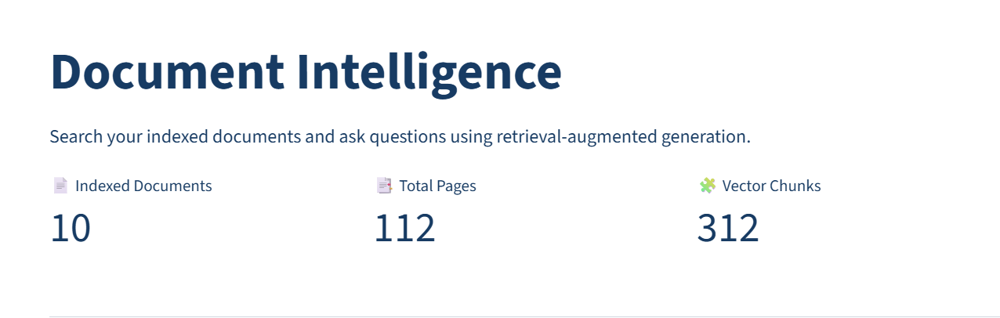
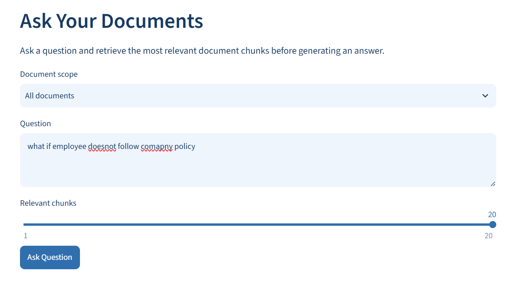
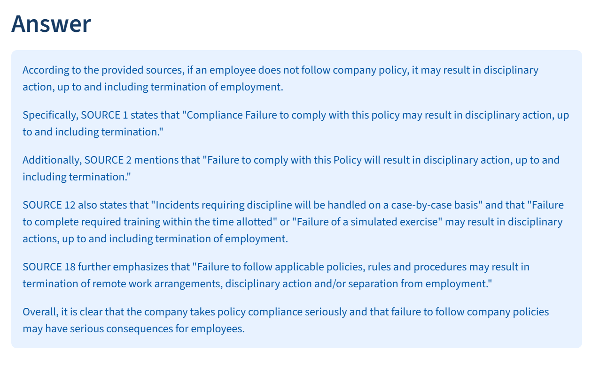

## Architecture

```text
PDF Document
     ↓
Streamlit Frontend
     ↓
FastAPI Backend
     ↓
Redis Job Queue
     ↓
Ingestion Worker
     ↓
PDF Parsing
     ↓
Text Chunking
     ↓
Embeddings
     ↓
Qdrant Vector Database
     ↓
Relevant Chunks
     ↓
Groq LLM
     ↓
Answer + Sources
```

## Features

- PDF document upload
- Asynchronous document ingestion
- Redis job queue
- PostgreSQL document tracking
- MinIO object storage
- PDF parsing
- Text chunking
- Sentence Transformer embeddings
- Qdrant vector search
- RAG question answering
- Source references
- Streamlit frontend
- FastAPI backend
- Docker Compose infrastructure
- Batch PDF ingestion

## Technology Stack

| Component | Technology |
|---|---|
| Frontend | Streamlit |
| Backend | FastAPI |
| Language | Python |
| Database | PostgreSQL |
| Queue | Redis |
| Object Storage | MinIO |
| Vector Database | Qdrant |
| PDF Processing | Docling |
| Embeddings | Sentence Transformers |
| LLM | Groq |
| Containers | Docker Compose |


## Screenshots

### Document Intelligence Dashboard

The RAG application provides a document intelligence workspace for searching indexed documents and asking questions using retrieval-augmented generation.



### Ask Your Documents

Users can select the document scope and ask questions against the indexed documents.



### RAG Generated Answer

The system retrieves relevant document chunks and generates an answer based on the indexed documents.




## Project Structure

```text
Rag-pipeline/
├── api/
│   ├── __init__.py
│   ├── app.py
│   └── requirements.txt
├── frontend/
│   ├── __init__.py
│   └── app.py
├── retriever/
│   ├── __init__.py
│   ├── embeddings.py
│   ├── qdrant_store.py
│   ├── rag.py
│   └── search_test.py
├── workers/
│   ├── __init__.py
│   └── ingest/
│       ├── __init__.py
│       ├── chunker.py
│       ├── downloader.py
│       ├── parser.py
│       ├── processor.py
│       └── worker.py
├── infra/
│   └── postgres/
│       └── init.sql
├── .streamlit/
│   └── config.toml
├── batch_ingest.py
├── docker-compose.yml
├── requirements.txt
├── .env.example
├── .gitignore
└── README.md
```

## Requirements

- Python 3.12
- Docker Desktop
- WSL2
- Git
- Groq API key

## Setup

```bash
python3 -m venv .venv
source .venv/bin/activate
pip install -r requirements.txt
cp .env.example .env
```

Update `.env` with your local configuration and Groq API key.

**Never commit `.env` to GitHub.**

## Start Docker Infrastructure

```bash
docker compose up -d
docker compose ps
```

The application uses:

- PostgreSQL
- Redis
- MinIO
- Qdrant
- Neo4j

## Start Backend

Open a new terminal:

```bash
cd "/mnt/c/Users/Anil Kumar/Downloads/Rag-pipeline"
source .venv/bin/activate
python -m uvicorn api.app:app --host 0.0.0.0 --port 8000
```

Test the backend:

```bash
curl http://127.0.0.1:8000/health
```

## Start Ingestion Worker

Open another terminal:

```bash
cd "/mnt/c/Users/Anil Kumar/Downloads/Rag-pipeline"
source .venv/bin/activate
python -m workers.ingest.worker
```

The worker listens for document jobs from:

```text
rag:jobs
```

Keep the worker running while using the application.

## Start Frontend

Open another terminal:

```bash
cd "/mnt/c/Users/Anil Kumar/Downloads/Rag-pipeline"
source .venv/bin/activate
python -m streamlit run frontend/app.py --server.port 8501
```

Open the application:

```text
http://localhost:8501
```

## Document Ingestion Flow

```text
PDF Upload
    ↓
FastAPI
    ↓
MinIO
    ↓
PostgreSQL
    ↓
Redis Job Queue
    ↓
Ingestion Worker
    ↓
PDF Parsing
    ↓
Text Chunking
    ↓
Embedding Generation
    ↓
Qdrant
```

## Question Answering Flow

```text
User Question
      ↓
Query Embedding
      ↓
Qdrant Similarity Search
      ↓
Relevant Chunks
      ↓
RAG Context
      ↓
Groq LLM
      ↓
Answer + Sources
```

## Testing

Upload a company-policy or employee-handbook PDF through the Streamlit application.

Example questions:

- What is the main purpose of this policy?
- Who does this policy apply to?
- What are the key requirements mentioned in the policy?
- What responsibilities are assigned to employees?
- Summarize the policy and list its three most important requirements.

A successful test should demonstrate:

1. PDF upload
2. Document registration
3. Redis job creation
4. Worker processing
5. PDF parsing
6. Chunk creation
7. Embedding generation
8. Qdrant storage
9. Relevant chunk retrieval
10. LLM answer generation
11. Source references

## Batch PDF Ingestion

```bash
python batch_ingest.py "/path/to/pdf-folder"
```

## Retrieval Test

```bash
python retriever/search_test.py
```

The retrieval test displays:

- Similarity score
- Document filename
- Page number
- Chunk ID
- Retrieved text

## Environment Variables

Use `.env.example` as the configuration template.

```text
POSTGRES_HOST
POSTGRES_PORT
POSTGRES_DB
POSTGRES_USER
POSTGRES_PASSWORD

REDIS_HOST
REDIS_PORT

MINIO_HOST
MINIO_PORT
MINIO_CONSOLE_PORT
MINIO_ROOT_USER
MINIO_ROOT_PASSWORD
MINIO_BUCKET

QDRANT_HOST
QDRANT_PORT
QDRANT_GRPC_PORT

NEO4J_USER
NEO4J_PASSWORD
NEO4J_HTTP_PORT
NEO4J_BOLT_PORT

GROQ_API_KEY
GROQ_MODEL
```

## Security

Do not commit sensitive configuration to GitHub.

`.env` must remain local. Use `.env.example` to document required configuration without exposing credentials.

Typical ignored files/directories:

```text
.env
.venv/
__pycache__/
*.pyc
```

## Project Status

The project provides an end-to-end local RAG workflow:

```text
Document Upload
      ↓
Document Ingestion
      ↓
PDF Processing
      ↓
Chunking
      ↓
Embedding
      ↓
Vector Retrieval
      ↓
RAG Generation
      ↓
Answer + Sources
```

This project demonstrates practical AI engineering concepts including document ingestion, asynchronous processing, vector search, and Retrieval-Augmented Generation.